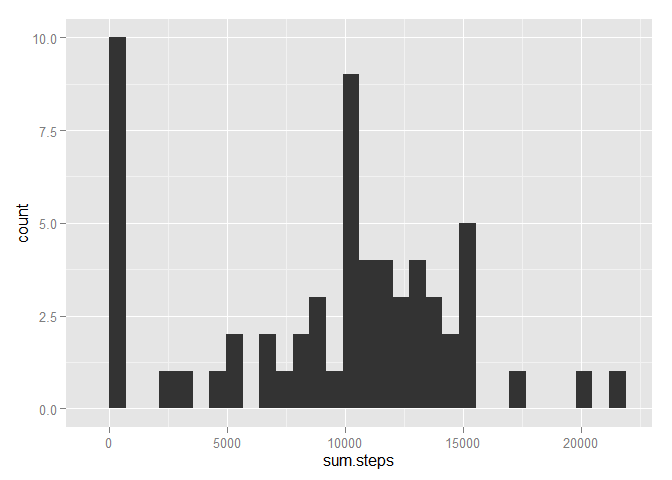
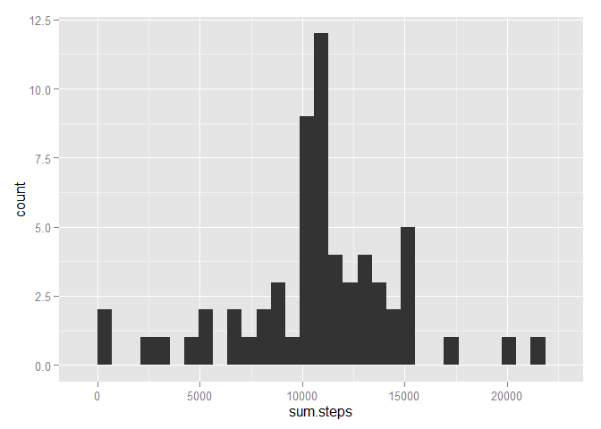
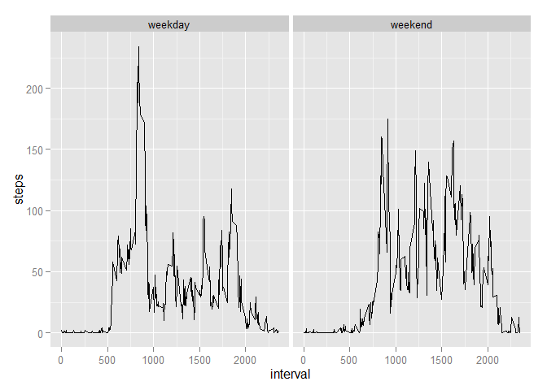

# Reproducible Research: Peer Assessment 1


## Loading and preprocessing the data


```r
library(dplyr)
```

```
## Warning: package 'dplyr' was built under R version 3.1.3
```

```
## 
## Attaching package: 'dplyr'
## 
## The following object is masked from 'package:stats':
## 
##     filter
## 
## The following objects are masked from 'package:base':
## 
##     intersect, setdiff, setequal, union
```

```r
library(ggplot2)
```

```
## Warning: package 'ggplot2' was built under R version 3.1.3
```

```r
activity <- read.csv("activity.csv")
```

## What is mean total number of steps taken per day?


```r
steps.by.day <- summarise(group_by(activity, date), sum.steps = sum(steps, na.rm = TRUE))
summarise(steps.by.day, mean(sum.steps), median(sum.steps))
```

```
## Source: local data frame [1 x 2]
## 
##   mean(sum.steps) median(sum.steps)
## 1         9354.23             10395
```

```r
qplot(sum.steps, data=steps.by.day)
```

 

## What is the average daily activity pattern?


```r
profile <- summarise(group_by(activity, interval), steps = mean(steps, na.rm = TRUE))
qplot(interval, steps, data = profile, geom = "line")
```

 

```r
profile$interval[which.max(profile$steps)]
```

```
## [1] 835
```

## Imputing missing values


```r
sum(is.na(activity))
```

```
## [1] 2304
```

```r
activity.nona <- activity
activity.nona$steps[is.na(activity.nona$steps)] <- rep(profile$steps, nrow(activity)%/%nrow(profile))[is.na(activity.nona$steps)]
steps.by.day.nona <- summarise(group_by(activity.nona, date), sum.steps = sum(steps, na.rm = TRUE))
summarise(steps.by.day.nona, mean(sum.steps), median(sum.steps))
```

```
## Source: local data frame [1 x 2]
## 
##   mean(sum.steps) median(sum.steps)
## 1        10766.19          10766.19
```

```r
qplot(sum.steps, data=steps.by.day.nona)
```

 

## Are there differences in activity patterns between weekdays and weekends?

```r
activity$weekdays <- factor(substr(weekdays(as.Date(activity$date)),1,1) == "S")
levels(activity$weekdays) <- c("weekday", "weekend")
weekprofile <- summarise(group_by(activity, interval, weekdays), steps = mean(steps, na.rm = TRUE))
qplot(interval, steps, data = weekprofile, facets = . ~ weekdays, geom = "line")
```

 
